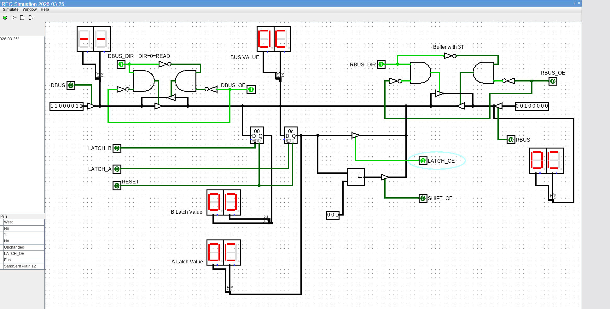

# Registers #

Updated 2026-03-25

## Register Overview ##

Influenced by a range of CPU designs, I have settled on the following specifications for the Registers.

There are eight (8) registers identified as R0 to R7.

Having eight registers means having 3 bits for a source and 3 bits for a destination register in the ISA format. Provision has been made to go to 4 bits allowing 16 registers in a more advanced design.

Registers R0-R3 will include the ability to perform the following instructions that would typically be handled by an ALU:

* INC / DEC
* BSET / BCLR / BTST
* Shifts / Rotates
* Zero / Invert / Bitwise OR / AND / XOR operations

Registers 4-7 will basically be latches but connected to at least 2 busses. The additonal connections will be one of the following:

* Primary ALU output result.
* Program Counter Latches.
* Stack Counter Latches.
* Future expansion (maybe I/O instructions).

### R0-R3 ###

R0 to R3 are known as "Advanced Registers" as they do more than just hold a value.
In order to implement basic bitwise operations in the first four registers, a second operand in required, this is provided by having an additional latch. This latch is identified as the "B" Latch and can be set using the 'XFER' instruction.
See the ISA for more details, but basically it's format is:

 XFER Rs,Rd - where Rs is the "source" register and Rd is the destination register.

This instruction allows the "A" Latch value of any other register to be loaded into the destination Register's "B" Latch so "bitwise" logic operations can be performed. You cannot read back the value of the "B" Latch.
If Rd is specified as R4 to R7 then no operation is performed.

### R4-R7 ###

These registers are basically a scalled down Advanced Register but contain additional logic to latch the value from the alternate Bus into the Register.

The instructions LDSP and LDPC are for reading and latching the SP and PC counters directly (not using the D or R Busses).
The ALU output is controlled via the ADD, SUB.DIV and MUL instruction logic.

<circuit here>

### Register Control ###

Each Register has a collection of signals to control the onboard logic, these signals are generated from the Register Controller/Sequencer (RCS) using hard logic rather than using an EPROM design (as used in many TTL CPU projects).
The Instruction Decoder generates the actual Instruction Signal such as "LD", "LDI", "XFER", "LDM" etc and presents the Source and Destination CPU Values to the register controller. The RCS then generates ENABLE signals for the source/destination registers and the Latch/Output enable signals combined with the T0-T6 signals. When the operation completes, another register based instruction can be loaded and executed if fetched next.

This simplifies the IR decode, execute logic and allows the Instruction fetch cycle to re-occur directly after the RCS takes over (it would do it's task(s) during the fetch, decode cycle), then be ready at the Execute cycle for the next register operation if there was one directly after the current one. Theoretically, a non-register instruction could be fetched and processed a few cycles after this sequence has started.

The first four Registers (R0-R3) will also include an Increment/Decrement capability to increase the speed of loop counting and Rotate/Shift Operations. Since logic gates are relatively cheap, adding bitwise logical operations such as AND, OR, XOR etc will also enhance each register.

### Possible Issues ###

There maybe timing issues to still debug but once I build the register modules, the design is 95% complete and is ready to prototype.
Using Logsim has shown the timing is working as expected.

### Localised ALU Functions ###

The flags from these operations would be pushed to a global flags register which is where the Instruction Registers would look if needed. Flags are latched at the ID stage.

### Secondary Register Latch ###

The first four registers have a secondary register latch ("B" Latch) to enable the basic ALU operations to be performed locally, the 2nd latch is loaded by an XFER instruction (XFER Rs, Rd) This would be different to a "LD" instruction which moves data into the "A" Latch of a Register. The XFER would load "A" and "B" at the same time. A logic operation would then be an XFER, followed by an LD, followed by the ALU operation. Results get written back to the "A" latch or if coded, transferred to another register using the R-BUS. The key points are the XFER is in progress as the LD is being fetched and decoded, then at the end of the LD, the ALU operation could execute. As it is occurring, another Instruction fetch is already in progress.

### R-BUS ###

Rather than a single bus for register access, I am aiming to provide two data buses, the conventional D-Bus and a separate register bus called "R-Bus" for register-to-register moves. This also includes moving data to and from the Stack Pointer Register and Program Counter Register.

Logisim Image of Advanced Register - 1st cut!

For arithmetic ALU operations like ADD, SUB, DIV and MUL, I can dedicate a register as the ALU results register (at this stage it's R0) and use the D-Bus and R-Bus as inputs to the Arithmetic ALU like other designs.

Reference Drawing

Current design Idea as of September 2025. I still need to drop this onto a bread board and complete the register control logic.

## Terminology ##

* Rs - Source Register
* Rd - Destination Register
* DBUS - Primary Data bus, connected to register file and RAM/ROM
* RBUS - Unique Register only Bus
* Primary ALU - Mathematical Operations
* RCS - Register Control/Sequencer
* T0 - Time State 0 (there are six "T" state -> T0-T6)
* R[0..7] - Register 0 to 7
* IR - Instruction Register - A latch to capture the Instruction as read from ROM before any decoding.
* IDR - Second IR latch in decode stage, 6 bits in size.

## Supporting Information ##

The ISA documentation is here: [isa.md](https://github.com/z900collector/CPU32-Assembler/blob/main/isa.md)

